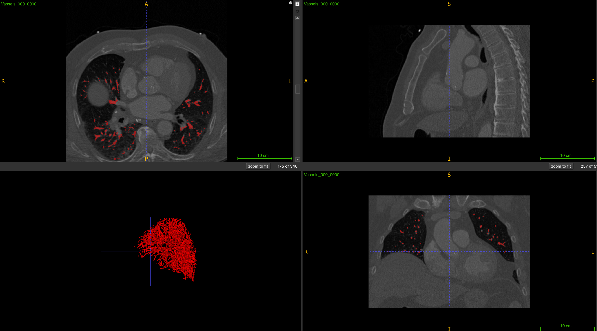
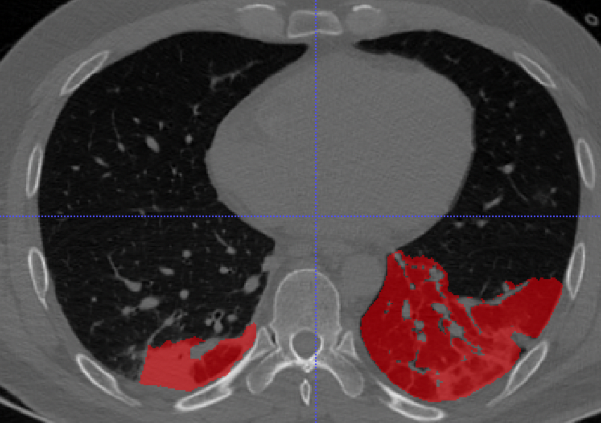

# Vascular Structure Segmentation in Lung CT Scans

## Project Overview
This project focuses on developing a pipeline using nnU-Net for segmenting vascular structures from Ground Glass Opacities (GGO) and consolidation masks in lung CT scans. The primary goal is to enhance the precision of medical imaging analysis by effectively separating the vascular mask from these specific areas.

### Technologies Used
- **Programming Language**: Python
- **Libraries & Frameworks**: nnU-Net, PyTorch, TensorFlow, DICOM
- **Data Processing**: NumPy, Pandas, OpenCV
- **Others**: Git, Docker

## Background
The challenge in medical imaging, particularly in lung CT scans, is to accurately distinguish vascular structures from Ground Glass Opacities (GGO) and consolidation areas. This project aims to develop a model capable of effectively identifying and segmenting these structures.

## Pipeline Overview
The Jupyter notebook includes several key stages:
1. **Dataset Description Writing** (`write_dataset_descp` function)
   - Creation of the `dataset.json` file, defining the dataset details.
   - Includes dataset name, description, image size, references, labels, etc.

2. **nnU-Net Environment Setup**
   - Setting up environment variables like `nnUNet_raw`, `nnUNet_preprocessed`, `RESULTS_FOLDER` to specify paths for datasets and outputs.

3. **Data Conversion and Preprocessing**
   - Execution of data set conversion and preprocessing steps for nnU-Net.

## Using the Python Script for Separation
Below is the script to separate vascular structures from GGO and consolidation masks within a NIfTI file:

```python
import nibabel as nib
import numpy as np

# Paths to the NIfTI files
ggo_consol_nifti_path = 'path_to_ggo_and_consolidation_mask_nifti_file.nii.gz'
vessel_nifti_path = 'path_to_vessel_structure_mask_nifti_file.nii.gz'

# Load the GGO and consolidation NIfTI file
ggo_consol_img = nib.load(ggo_consol_nifti_path)
ggo_consol_data = ggo_consol_img.get_fdata()

# Load the vessel structure NIfTI file
vessel_img = nib.load(vessel_nifti_path)
vessel_data = vessel_img.get_fdata()

# Subtract the vessel structure mask from the GGO and consolidation mask
# This assumes that the vessel mask is binary (1 for vessels, 0 for non-vessels)
separated_mask_data = ggo_consol_data - vessel_data
separated_mask_data[separated_mask_data < 0] = 0  # Remove negative values resulting from subtraction

# Save the separated mask as a new NIfTI image
separated_mask_img = nib.Nifti1Image(separated_mask_data, ggo_consol_img.affine, ggo_consol_img.header)
nib.save(separated_mask_img, 'separated_mask.nii.gz')

print("The vessel structures have been separated from the GGO and consolidation mask.")
```

To use this script:
1. Install the required libraries by running `pip install nibabel numpy`.
2. Replace the placeholder paths in the script with the actual paths to your NIfTI files.
3. Run the script to perform the separation.
4. The output file `separated_mask.nii.gz` will contain the GGO and consolidation masks with the vascular structures removed.

## Images
Below are examples of the image data used in the project:

1. Vascular structure image file:
   

2. Final training dataset image with vascular mask separated:
   

## Model Training and Evaluation
Detailed information about the model training process, performance evaluation methods, and analysis of the results are covered in separate sections.

## Results and Applications
The results obtained from this pipeline are crucial for enhancing the accuracy of lung tissue analysis in CT scans. By effectively segmenting vascular structures from GGO and consolidation masks, the project contributes to improved diagnostic accuracy in clinical settings.

## Challenges and Solutions
Focus was placed on managing the complexity of high-resolution medical image data and developing strategies for efficient use of computing resources.

---

Feel free to modify or extend this README file as needed for your project.
